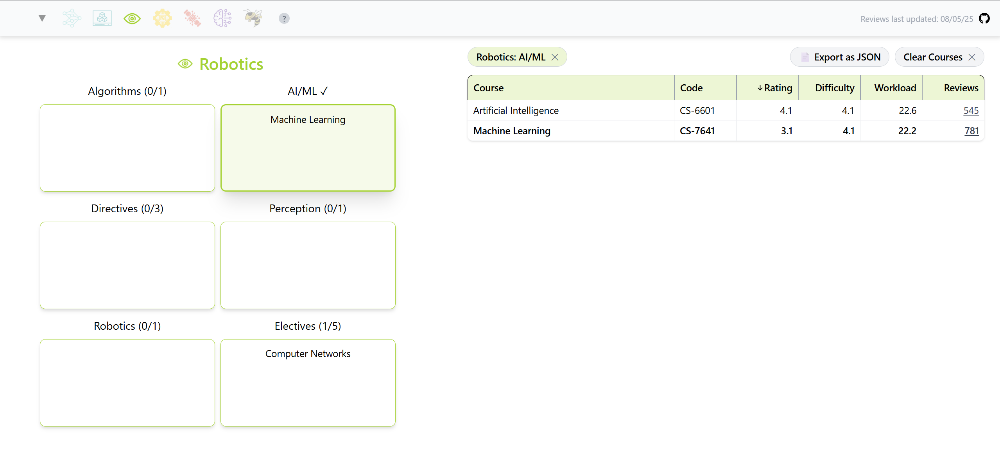

# OMSChecklist

➡️ Try it out on https://omschecklist.vercel.app/

## About

Georgia Tech's Online Masters of Computer Science program has [six](https://omscs.gatech.edu/specializations) primary degree tracks.

This tool allows you to navigate the course catalog per track requirement. Just click on a track icon to get started.

It also lets you group courses into semesters to preview the estimated difficulty and workload of your groupings (semesters tab🐝).

It aggregates review statistics from the [OMSCentral](https://www.omscentral.com) and [OMSHub](https://www.omshub.org) sites.

These reviews are statically pulled at the moment. No client-side scraping will ever be used to grab site data.
